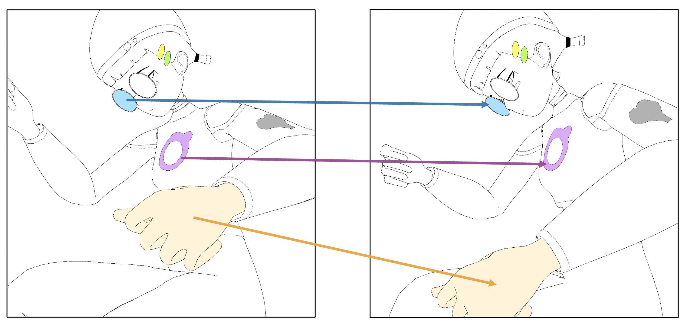

# Region-Wise Correspondence Prediction between Manga Line Art Images (CVPR 2026)
This repository contains the official implementation of our paper: **Region-Wise Correspondence Prediction between Manga Line Art Images**  
[Paper](https://arxiv.org/abs/2509.09501) | Poster | Dataset

## 🔍 Overview

<p align="center">
  
</p>

Understanding region-wise correspondences between manga line art images is fundamental for high-level manga processing, supporting downstream tasks such as line art colorization and in-between frame generation. Unlike natural images that contain rich visual cues, manga line art consists only of sparse black-and-white strokes, making it challenging to determine which regions correspond across images. In this work, we introduce a new task: **predicting region-wise correspondence between raw manga line art images without any annotations**. To address this problem, we propose a Transformer-based framework trained on large-scale, automatically generated region correspondences. The model learns to suppress noisy matches and strengthen consistent structural relationships, resulting in robust patch-level feature alignment within and across images. During inference, our method segments each line art and establishes coherent region-level correspondences through edge-aware clustering and region matching. We construct manually annotated benchmarks for evaluation, and experiments across multiple datasets demonstrate both high patch-level accuracy and strong region-level correspondence performance, achieving 78.4-84.4% region-level accuracy. These results highlight the potential of our method for real-world manga and animation applications.

---

## 📦 Repository Structure

This repository includes:

- Training and evaluation code  
- Inference and visualization scripts  
- Configuration files and experiment settings  

---

## 📊 Dataset

We release the **evaluation dataset and annotation tools** in a separate repository:

👉 **Dataset Repository (Coming Soon)**

The dataset repository will include:
- Test set for evaluation  
- Annotation tools for region correspondence   

---

## 🚧 TODO

- [ ] Release training and inference code  
- [ ] Release dataset  
- [ ] Release annotation tools  
- [ ] Add detailed documentation  

---

## 📌 Citation

If you find this work useful, please consider citing:

```bibtex
@inproceedings{li2026r2r,
  title={Region-Wise Correspondence Prediction between Manga Line Art Images},
  author={Li, Yingxuan and Mao, Jiafeng and Qiu, Qianru and Matsui, Yusuke},
  booktitle={Proceedings of the IEEE/CVF Conference on Computer Vision and Pattern Recognition},
  year={2026}
}
