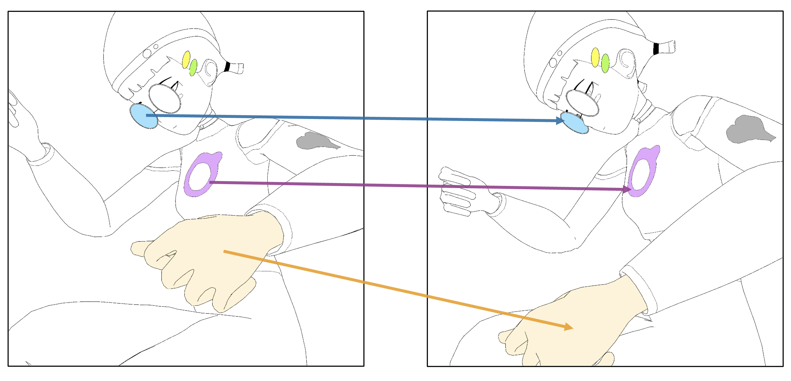

# Region-Wise Correspondence Prediction between Manga Line Art Images (CVPR 2026)
This repository contains the official implementation of our paper: **Region-Wise Correspondence Prediction between Manga Line Art Images**  
[Paper](https://arxiv.org/abs/2509.09501) | Poster | Dataset

## Overview

<p align="center">
  
</p>

Understanding region-wise correspondences between manga line art images is fundamental for high-level manga processing, supporting downstream tasks such as line art colorization and in-between frame generation. Unlike natural images that contain rich visual cues, manga line art consists only of sparse black-and-white strokes, making it challenging to determine which regions correspond across images. In this work, we introduce a new task: **predicting region-wise correspondence between raw manga line art images without any annotations**. To address this problem, we propose a Transformer-based framework trained on large-scale, automatically generated region correspondences. The model learns to suppress noisy matches and strengthen consistent structural relationships, resulting in robust patch-level feature alignment within and across images. During inference, our method segments each line art and establishes coherent region-level correspondences through edge-aware clustering and region matching. We construct manually annotated benchmarks for evaluation, and experiments across multiple datasets demonstrate both high patch-level accuracy and strong region-level correspondence performance, achieving 78.4-84.4% region-level accuracy. These results highlight the potential of our method for real-world manga and animation applications.

---

## Repository Structure

```
├── model.py                      # LineArtTransformerModel (ViT-B/16 backbone + LoFTR encoder)
├── data.py                       # Dataset classes (LineArtDataset, PBCLineArtDataset)
├── train.py                      # Training with DDP
├── train_PBC.py                  # Training on PaintBucket-Character dataset
├── test_patch.py                 # Patch-level evaluation (Top-K accuracy, PR curve)
├── test_patch_with_ap.py         # Patch-level evaluation with Average Precision
├── test_region_single.py         # Region-level evaluation on a single image pair (with GT)
├── test_region_batch.py          # Region-level batch evaluation over a dataset
├── test_region_single_wo_gt.py   # Inference on arbitrary image pairs (no GT required)
├── loftr_module/
│   ├── transformer.py            # LoFTR encoder (multi-head attention)
│   └── linear_attention.py      # Linear and full attention implementations
└── requirements.txt
```

---

## Installation

```bash
# Clone the repository
git clone https://github.com/yingxuanli/r2r-lineart-correspondence.git
cd r2r-lineart-correspondence

# Install dependencies (Python >= 3.8, PyTorch >= 2.0 recommended)
pip install -r requirements.txt
```

---

## Dataset

We use two datasets for training and evaluation:

- **In-house training data** — our internal dataset of manga/animation keyframe pairs with automatically generated region correspondences. See the [dataset repository (coming soon)](#) for the evaluation split and annotation tools.
- **[PaintBucket-Character (PBC)](https://github.com/WebDT-Research/PaintBucketCharacter)** — a publicly available dataset of anime character illustrations with pixel-level region labels.

The CSV files used by our data loaders follow this format:

```
dir,reference,target
scene_001,frame_01.jpg,frame_02.jpg
...
```

---

## Training

### Training on the in-house dataset

```bash
torchrun --nproc_per_node=NUM_GPUS train.py \
    --csv_path path/to/pair_frames.csv \
    --root_lineart path/to/lineart_images \
    --root_label path/to/label_images \
    --epochs 30 \
    --batch_size 64 \
    --lr 2e-4 \
    --patch_size 32
```

### Training on PaintBucket-Character

```bash
python train_PBC.py \
    --root_dir path/to/PaintBucket_Char \
    --epochs 20 \
    --batch_size 16
```

---

## Evaluation

### Patch-level evaluation

```bash
# Top-K accuracy and PR curve
python test_patch.py \
    --csv_path path/to/eval_pairs.csv \
    --root_lineart path/to/lineart_images \
    --root_label path/to/label_images \
    --model_path path/to/checkpoint.pth

# With Average Precision (in-house eval set)
python test_patch_with_ap.py \
    --csv_path path/to/eval_pairs.csv \
    --root_lineart path/to/lineart_images \
    --root_label path/to/label_images \
    --model_path path/to/checkpoint.pth

# With Average Precision (PBC eval set)
python test_patch_with_ap.py \
    --is-pbc \
    --pbc_root path/to/PaintBucket_Char/train/PaintBucket_Char \
    --model_path path/to/checkpoint.pth
```

### Region-level evaluation

```bash
# Single pair (with GT), in-house dataset
python test_region_single.py \
    --csv-path path/to/eval_pairs.csv \
    --lineart-dir path/to/lineart_images \
    --labels-dir path/to/label_images \
    --model-path path/to/checkpoint.pth \
    --pair-index 0

# Single pair (with GT), PBC mode
python test_region_single.py \
    --is-pbc \
    --pbc-root path/to/PaintBucket_Char/train/PaintBucket_Char \
    --model-path path/to/checkpoint.pth

# Batch evaluation over the full eval set
python test_region_batch.py \
    --csv-path path/to/eval_pairs.csv \
    --lineart-dir path/to/lineart_images \
    --labels-dir path/to/label_images \
    --model-path path/to/checkpoint.pth \
    --out-dir results/
```

### Inference without ground truth

Run the model on any pair of line-art images:

```bash
python test_region_single_wo_gt.py \
    --ref-img path/to/reference.jpg \
    --tgt-img path/to/target.jpg \
    --model-path path/to/checkpoint.pth \
    --out-dir results/
```

---

## Dataset Repository

We release the **evaluation dataset and annotation tools** in a separate repository:

👉 **Dataset Repository (Coming Soon)**

The dataset repository will include:
- Test set for evaluation
- Annotation tools for region correspondence

---

## TODO

- [ ] Release evaluation dataset
- [ ] Release annotation tools
- [ ] Add detailed documentation

---

## Citation

If you find this work useful, please consider citing:

```bibtex
@inproceedings{li2026r2r,
  title={Region-Wise Correspondence Prediction between Manga Line Art Images},
  author={Li, Yingxuan and Mao, Jiafeng and Qiu, Qianru and Matsui, Yusuke},
  booktitle={Proceedings of the IEEE/CVF Conference on Computer Vision and Pattern Recognition},
  year={2026}
}
```
